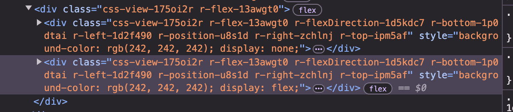
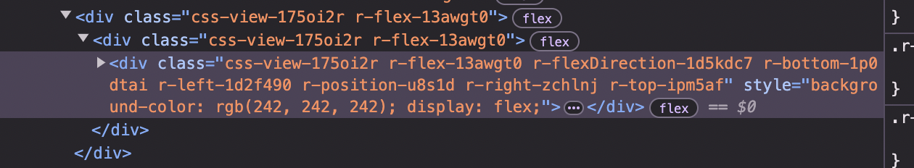

# Tabs layout is mounting twice when using Redirect and setting `unstable_settings` on the parent layout.

Steps to reproduce:

1. Install deps: `npm i`
2. Launch the app using: `npm run web`
3. In the browser url navigate to: `/other/redirect`
4. Check the html, you can see the tabs stack is now in double. (see img below)

If you remove the `unstable_settings` from `(app)/_layout.tsx` and do the same steps, you'll see that after the redirect is completed, expo router is using the same initial tabs router. (See image below)

